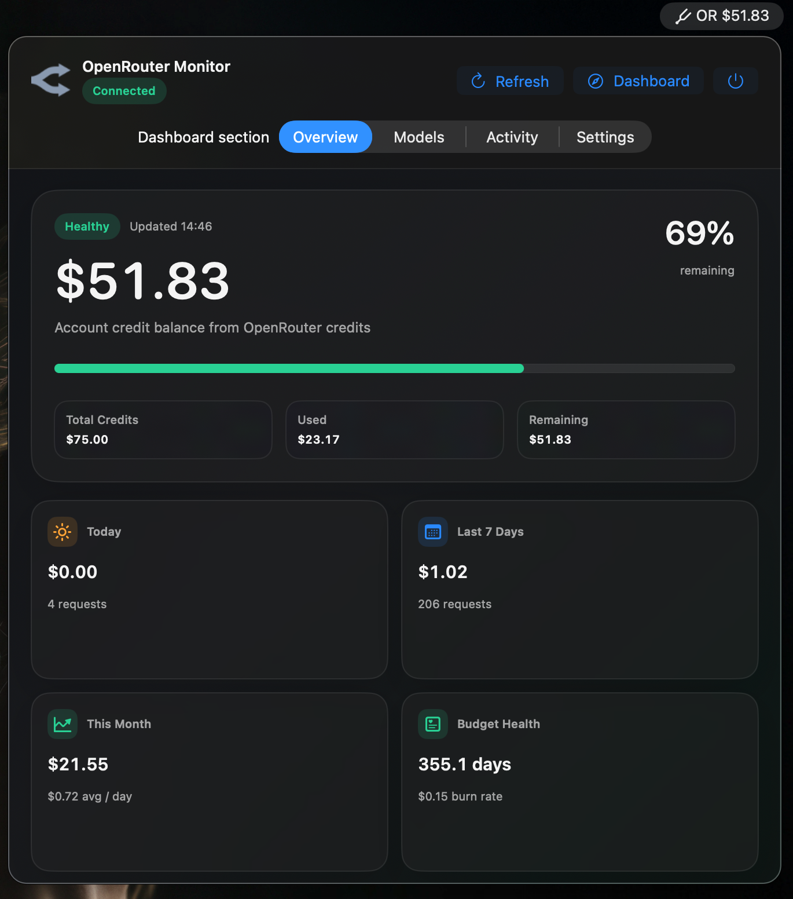

# OpenRouter Monitor for macOS

OpenRouter Monitor is a native macOS menu bar app for keeping an eye on OpenRouter API spend without opening a browser dashboard.

It is built for developers, AI power users, and small teams using OpenRouter for coding agents, prototypes, production apps, or personal AI workflows. The app shows your current usage at a glance, tracks budget thresholds, and surfaces model-level activity when your API key has access to OpenRouter management analytics. The interface uses native macOS controls and stable, opaque system surfaces so account data remains clear in both light and dark appearances.



## Features

- macOS menu bar item with a compact usage readout.
- Native SwiftUI popover dashboard.
- Dedicated native Settings window with system-style controls.
- OpenRouter API keys validated before being stored in Apple Keychain.
- Local-only cache for non-secret settings and usage snapshots.
- Immediate, manual, and scheduled refresh with setup, refreshing, connected, partial, stale, and offline states.
- Key usage summary from OpenRouter.
- Optional account credit balance for management-capable keys.
- Optional model breakdown from OpenRouter activity analytics.
- Interactive 30-day spend chart with dates, BYOK comparison, hover selection, token totals, and request totals.
- BYOK-inclusive usage totals and BYOK/OpenRouter usage split.
- Credit burn-down estimate based on remaining credits and recent spend.
- Per-key spend overview for management-capable keys.
- Tracked model pricing view for comparing current OpenRouter input and output rates.
- Searchable OpenRouter model catalog and one-click price tracking from model activity.
- Optional launch-at-login setting.
- USD and GBP display, with manual USD-to-GBP conversion.
- Configurable notifications for budget thresholds and refresh failures, with a test action.
- JSON export for local cached settings and usage data; API keys are never included.
- Direct link to the OpenRouter dashboard.

## Recent UI And UX Improvements

- Simplified the popover to three focused sections: **Overview**, **Models**, and **Activity**.
- Moved configuration into a dedicated native Settings window.
- Added compact native toolbar actions for refresh, Settings, OpenRouter activity, and quit.
- Added immediate refresh when the app starts, plus clearer setup, refreshing, connected, partial, stale, and offline states.
- Prevented an empty API-key field from replacing or deleting the stored key.
- Added validation before Keychain storage, automatic analytics-access detection, and an explicit confirmed removal action.
- Added persistent budget labels, currency units, and inline validation feedback.
- Added searchable model discovery and one-click price tracking directly from model activity.
- Added individual notification controls, refresh-failure deduplication, permission status, and a test-notification action.
- Added JSON export for cached settings and usage snapshots without exporting API keys.
- Replaced refractive Liquid Glass content cards with stable semantic macOS surfaces, removing reflected navigation, colour bleeding, and position-dependent tint changes.
- Reduced panel borders and shadows and removed the coloured dashboard background wash for cleaner visual hierarchy.

## What It Shows

The menu bar can show one of three display modes:

- Remaining balance
- Percent remaining
- Today's spend

The popover dashboard is divided into three sections.

### Overview

- Current balance or key limit status
- Today, week, month, and all-time usage when key-level data is available
- Remaining-credit percentage and budget health

### Models

- Top model breakdown for recent activity when available
- Request, token, cost, and usage-share summaries
- One-click tracking for models seen in recent activity
- Current input, output, and context pricing for user-tracked model IDs

### Activity

- Latest day, last 7 days, last 30 days, and request counts when activity data is available
- Interactive 30-day spend trend with visible date labels and BYOK comparison
- BYOK and OpenRouter spend split
- Credit burn-down estimate when account credits and activity data are available
- Per-key spend, remaining limits, disabled status, and near-expiration labels when key list access is available

Across the dashboard, the app also shows:

- Connection and refresh status
- Quick actions for refresh, OpenRouter activity, and settings

The separate Settings window includes API-key management, startup behavior, refresh interval, menu-bar display, tracked models, budgets, currency conversion, notification controls, connection details, and JSON export.

## API Access

The app uses the following OpenRouter endpoints:

- `GET /api/v1/key`
  - Used for key-level usage.
  - Works with a normal OpenRouter API key.

- `GET /api/v1/credits`
  - Used for account credit balance.
  - Requires a management-capable key.

- `GET /api/v1/activity`
  - Used for model-level activity grouped by model/endpoint.
  - Also powers the spend trend, BYOK split, request totals, token totals, and burn-down average.
  - Requires a management-capable key.
  - Covers recent activity returned by OpenRouter.

- `GET /api/v1/keys?include_disabled=true`
  - Used for the per-key spend overview.
  - Requires a management-capable key.

- `GET /api/v1/models`
  - Used for current model pricing in the tracked pricing view.
  - Works without a saved API key in the app.

If a management-only endpoint returns `403 Forbidden`, the app still keeps the key-level refresh working and shows a warning for the unavailable account, activity, or key-list data.

New keys are checked against OpenRouter before they are stored. The app also probes account-credit access to determine whether the key supports management analytics. A failed validation leaves the previously stored Keychain value unchanged.

## Privacy And Storage

The API key is stored only in Apple Keychain.

Non-secret app data is stored locally at:

```text
~/Library/Application Support/OpenRouterMonitor/state.json
```

That file may contain:

- UI settings
- Budget thresholds
- Cached usage snapshots
- Cached model activity returned by OpenRouter
- Cached API key list metadata returned by OpenRouter
- Tracked model IDs and cached pricing metadata returned by OpenRouter
- Last refresh status and warnings

The app does not send data to any service other than OpenRouter.

The Settings window can export the cached state as JSON. The export contains the same non-secret settings and usage data described above; the Keychain API key is never included.

## Requirements

- macOS 14 or newer
- Swift toolchain with SwiftPM
- An OpenRouter API key
- A management-capable OpenRouter key for account balance and model activity

## Build

```bash
swift build
```

## Run

```bash
swift run OpenRouterMonitor
```

When launched through SwiftPM, the app runs as a raw executable rather than a packaged `.app` bundle. Most functionality works, but macOS notifications are skipped in this mode because `UNUserNotificationCenter` requires a real app bundle.

## Create a macOS App Bundle

```bash
./scripts/package_app.sh
```

The packaged app is created at:

```text
dist/OpenRouterMonitor.app
```

The local bundle is ad-hoc signed for development use. It is not notarized.

## Create an Installer DMG

```bash
./scripts/package_dmg.sh
```

The DMG is created at:

```text
dist/OpenRouterMonitor.dmg
```

The DMG contains `OpenRouterMonitor.app` and an `Applications` shortcut for drag-to-install. The app inside the DMG is ad-hoc signed for local development, not notarized.

You can verify the generated image and bundled app with:

```bash
hdiutil verify dist/OpenRouterMonitor.dmg
codesign --verify --deep --strict --verbose=2 dist/OpenRouterMonitor.app
```

## Distribute a Release

Do not commit the generated `.app` bundle or `.dmg` installer to the repository as normal tracked files. They are build artifacts and should stay out of git history.

Recommended release flow:

1. Build the installer:

    ```bash
    ./scripts/package_dmg.sh
    ```

2. Create and push a version tag:

    ```bash
    git tag v0.1.0
    git push origin v0.1.0
    ```

3. Create a GitHub Release for that tag.
4. Upload `dist/OpenRouterMonitor.dmg` as a release asset.

This keeps the repository source-focused while giving users a clear downloadable installer from the Releases page.

## Install From the DMG

After creating the DMG:

1. Open `dist/OpenRouterMonitor.dmg`.
2. Drag `OpenRouterMonitor.app` into `Applications`.
3. Launch it from Applications.

Because the app is currently ad-hoc signed and not notarized, macOS may show a Gatekeeper warning on first launch outside this development machine.

## Launch At Login

Open the app's Settings window and enable **Launch OpenRouter Monitor at login** to start the menu bar app automatically when you sign in to macOS.

This uses macOS Login Items through `SMAppService`. If macOS reports that approval is required, open System Settings and approve OpenRouter Monitor under Login Items. This setting should be tested from the packaged `.app` bundle, ideally after moving it to `/Applications`; it is not reliable when running the app as a raw SwiftPM executable with `swift run`.

## Checks

This project includes an executable check target:

```bash
swift run OpenRouterMonitorCoreChecks
```

The checks cover:

- OpenRouter response decoding
- Balance and percent calculations
- USD/GBP display formatting
- Menu bar title formatting
- BYOK-inclusive usage totals
- Alert threshold deduping
- Mocked key-only refresh
- Mocked management refresh
- API key list decoding and fetching
- Model pricing decoding and fetching
- Activity decoding and model aggregation
- Activity spend trend aggregation
- Credit burn-down calculation
- HTTP error mapping
- Malformed response handling
- Transport failure handling

## Project Structure

```text
Sources/
  OpenRouterMonitor/
    SwiftUI macOS app, menu bar UI, dashboard, settings, Keychain, local persistence

  OpenRouterMonitorCore/
    API models, OpenRouter client, refresh service, formatters, alert evaluation

  OpenRouterMonitorCoreChecks/
    Command-line verification target
```

## Current Limitations

- The packaged app and DMG are ad-hoc signed, not notarized.
- Notifications are disabled only when running through `swift run`; use the packaged `.app` for bundle-dependent macOS APIs.
- GBP conversion uses a manual exchange rate.
- Model breakdown depends on OpenRouter management activity access.
- Spend trend, BYOK split, and burn-down widgets depend on OpenRouter activity access.
- Per-key spend depends on OpenRouter key-list access.
- No multi-key or multi-account UI yet.
- No local proxy/import mode for generation-level tracing yet.

## Roadmap

Planned next steps:

- Add Developer ID signing and notarization.
- Add a polished DMG background and layout.
- Add multi-key profiles.
- Add historical model analytics views.
- Add automated light- and dark-appearance visual regression checks.
- Add optional local proxy/import support for generation-level cost tracing.

## License

OpenRouter Monitor is licensed under the GNU General Public License v3.0.

See [LICENSE](LICENSE) for the full license text.
