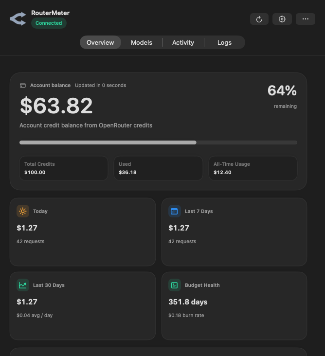
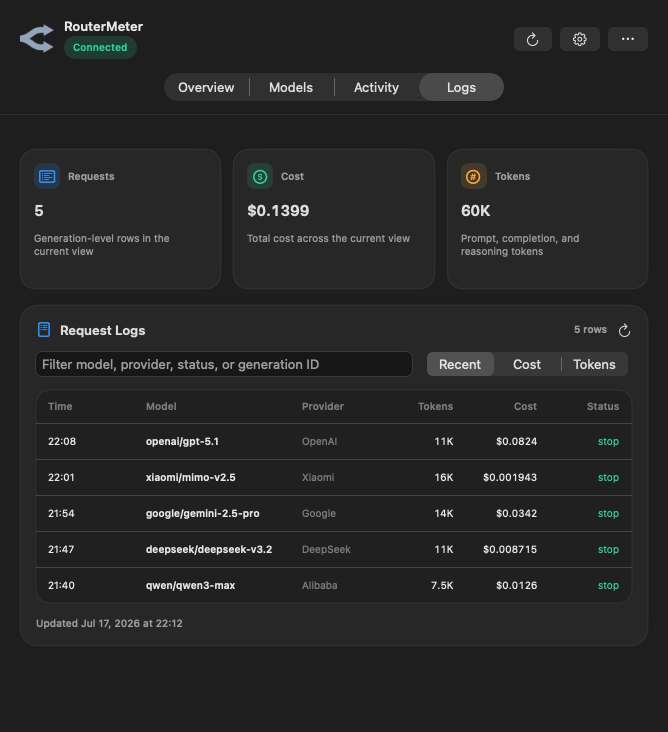

<p align="center">
  <a href="README.md">中文</a> · <strong>English</strong>
</p>

# RouterMeter for macOS

<p align="center">
  <strong>OpenRouter balance, daily spend, model costs, and request logs — right from your Mac menu bar.</strong>
</p>

<p align="center">
  🍎 Native macOS app&nbsp;&nbsp;·&nbsp;&nbsp;💸 Cost monitoring&nbsp;&nbsp;·&nbsp;&nbsp;📋 Request logs&nbsp;&nbsp;·&nbsp;&nbsp;🔐 Local-first privacy
</p>

RouterMeter is a native macOS menu bar utility for people who use OpenRouter and want a faster way to understand where their credits are going. It keeps the most useful account information close at hand without requiring you to keep the OpenRouter dashboard open in a browser.

Open the menu bar panel to check today's spend, remaining balance, recent model usage, per-model costs, account activity, and generation-level request logs.

<p align="center">
  
</p>

<p align="center">
  
</p>

## ✨ Highlights

| Feature | What it gives you |
| --- | --- |
| 💳 Account overview | Remaining OpenRouter credit, all-time usage, and budget health |
| ☀️ Today's spend | Account-level spending for the current local calendar day |
| 🧭 Menu bar status | Show balance, percentage remaining, today's spend, or spend and balance together |
| 🧊 Model breakdown | Requests, tokens, and cost grouped by model |
| 📋 Request Logs | Generation-level history with model, provider, cost, tokens, latency, and status |
| 📈 Activity analytics | Seven-day and thirty-day spend windows, BYOK usage, and trend charts |
| 🔭 Spend forecast | Estimated month-end spend and unusual pace detection |
| 🩺 Key health | API key limits, remaining allowance, expiration, and account warnings |
| 🏷️ Price tracking | Prompt and completion prices, context windows, and model catalog changes |
| 🎞️ Native motion | Subtle SwiftUI transitions that respect Reduce Motion |
| 🔐 Local storage | API keys stay in Apple Keychain; RouterMeter has no backend server |

## 🧩 Why RouterMeter Exists

RouterMeter is based on [OpenRouter Monitor](https://github.com/godsall-dev/openrouter-usage-menu-macos), which already provides a strong foundation for balance monitoring, budgets, model analytics, and activity trends.

RouterMeter focuses on several everyday gaps in the original experience:

- Management Keys could expose account-wide information, while the menu bar's “Today” value could still reflect only the current key.
- The original dashboard summarized models but did not provide generation-level request history.
- The menu bar could show a balance or daily spend, but not both at the same time.
- Costs were displayed with fixed two-decimal precision, causing inexpensive calls to appear as `$0.00`.
- “Today” could reuse the latest active date when there was no activity on the current day.
- Seven-day request totals could represent the last seven active dates instead of a real seven-day calendar window.
- “This Month” could fall back to a rolling thirty-day value.
- The original app identity, Keychain service, bundle identifier, and cache location were shared with the upstream project.

RouterMeter keeps the useful monitoring foundation and turns it into a more focused cost and request observability tool.

## 💸 Spending and Balance

RouterMeter can display:

- OpenRouter account credit balance
- Total credit purchased and total credit used
- Today's account-level spend
- Last seven calendar days of spend
- Current calendar month spend
- Thirty-day activity totals
- Average daily burn rate
- Estimated days of credit remaining
- Projected month-end spend
- Configurable daily and monthly budget warnings

For Management Keys, today's account-level value is calculated from OpenRouter Analytics using the Mac's local calendar-day boundaries.

## 📋 Generation-Level Request Logs

The Logs section shows up to 100 recent OpenRouter generations and supports:

- Search by model, provider, Generation ID, status, or request metadata
- Sorting by newest request, highest cost, or token count
- Model and provider information
- Prompt, completion, and reasoning token totals
- Exact request cost with adaptive precision
- Latency and generation duration
- Finish reason and cancellation state
- Streaming and BYOK indicators
- Local detail caching to reduce repeated API requests

RouterMeter reads generation metadata only. It does not download prompt text or model response content.

### Adaptive cost precision

Small calls remain visible instead of being rounded away:

```text
$12.50
$0.0125
$0.001943
```

## 🎞️ Native macOS Experience

RouterMeter is written in Swift and SwiftUI and is designed as a menu bar application rather than a web dashboard wrapped in a desktop shell.

The interface includes:

- A lightweight menu panel entrance transition
- Direction-aware transitions between Overview, Models, Activity, and Logs
- Numeric transitions for changing balances, costs, and request counts
- Native progress indicators during refresh
- Automatic support for macOS Reduce Motion
- Native Keychain, notifications, login items, charts, and system materials

Animations are intentionally short and restrained so the app still feels immediate during frequent use.

## 🔑 API Key Access

A regular OpenRouter API key can provide the current key's basic usage information.

The following features require an **OpenRouter Management API Key**:

- Account credit balance
- Account-level local-day spend
- API key list and account analytics
- Model and provider activity breakdowns
- Generation-level Request Logs

RouterMeter only uses read-only account and analytics endpoints. It does not use your key to run model inference.

## 🔐 Privacy and Security

- The OpenRouter API key is stored in Apple Keychain.
- The local state file does not contain the API key.
- Request Logs do not download prompts or model responses.
- RouterMeter does not operate a separate backend service.
- Account data is not uploaded to a RouterMeter server.
- Cached metadata stays inside the app's local Application Support directory.

Local application data is stored at:

```text
~/Library/Application Support/RouterMeter/state.json
```

## 🧱 Independent App Identity

RouterMeter uses its own application identity so it can coexist with the upstream OpenRouter Monitor app:

```text
Application name: RouterMeter
Bundle ID:        local.routermeter.mac
Keychain service: local.routermeter.openrouter
Local cache:      ~/Library/Application Support/RouterMeter/state.json
```

## 📦 Installation

1. Download the latest `RouterMeter.dmg` from [GitHub Releases](https://github.com/kongfihy/RouterMeter/releases).
2. Open the DMG.
3. Drag `RouterMeter.app` into the Applications folder.
4. Launch RouterMeter and save your OpenRouter API key in Settings.

### Gatekeeper and SIP

Current beta builds are ad-hoc signed and are not signed with an Apple Developer ID or notarized. A Mac with Gatekeeper enabled may block the first launch.

> [!IMPORTANT]
> RouterMeter does not require SIP to be disabled. Prefer approving only RouterMeter or removing only its quarantine attribute. Disable Gatekeeper globally only if you understand the security impact.

#### Option 1: Approve only RouterMeter — recommended

1. Try to open `RouterMeter.app` once.
2. Open **System Settings → Privacy & Security**.
3. Find the message saying RouterMeter was blocked.
4. Select **Open Anyway**.
5. Confirm with Touch ID or an administrator password.

This creates an exception for RouterMeter without weakening checks for other downloaded applications.

#### Option 2: Remove only RouterMeter's quarantine attribute

After confirming that the app came from this repository's official Release, run:

```bash
sudo xattr -dr com.apple.quarantine /Applications/RouterMeter.app
open /Applications/RouterMeter.app
```

This does not disable Gatekeeper system-wide. Do not use this command on software from an untrusted source.

#### Option 3: Disable Gatekeeper globally — not recommended

Check the current status:

```bash
spctl --status
```

On newer macOS releases, run:

```bash
sudo spctl --global-disable
```

This reveals the **Anywhere** option under **System Settings → Privacy & Security**. Open Settings and manually select **Anywhere**.

On macOS 14, use the following command if `--global-disable` is unavailable:

```bash
sudo spctl --master-disable
```

After RouterMeter launches successfully, re-enable Gatekeeper:

```bash
sudo spctl --global-enable
```

On macOS 14, use:

```bash
sudo spctl --master-enable
```

Then restore **App Store & Known Developers** under Privacy & Security.

#### When SIP is enabled — recommended

Check SIP with:

```bash
csrutil status
```

If the result is:

```text
System Integrity Protection status: enabled.
```

You can still use Open Anyway, remove RouterMeter's quarantine attribute, or change Gatekeeper settings. **You do not need to disable SIP to run RouterMeter.**

#### When SIP is already disabled

If the result is:

```text
System Integrity Protection status: disabled.
```

Use the same RouterMeter approval steps. SIP and Gatekeeper are separate security mechanisms, so disabling SIP does not automatically disable Gatekeeper.

#### Enabling or disabling SIP

> [!WARNING]
> Disabling SIP reduces protection for the entire operating system. RouterMeter does not require this. These steps are included only for advanced system maintenance or for restoring SIP on a Mac where it is already disabled.

On Apple Silicon, shut down the Mac, hold the power button until startup options appear, select **Options → Continue**, and open **Utilities → Terminal** in Recovery.

On an Intel Mac, restart while holding `Command-R`, then open **Utilities → Terminal**.

Disable SIP:

```bash
csrutil disable
reboot
```

Re-enable SIP — recommended:

```bash
csrutil enable
reboot
```

A future release can use Developer ID signing and Apple notarization to avoid these extra first-launch steps.

## 🖥️ System Requirements

- macOS 14 Sonoma or later
- OpenRouter API key
- OpenRouter Management API Key for account balance, account analytics, and Logs
- Xcode Command Line Tools and Swift 6.1 only when building from source

## 🛠️ Build from Source

```bash
git clone https://github.com/kongfihy/RouterMeter.git
cd RouterMeter
swift run OpenRouterMonitor
```

Run the core verification suite:

```bash
swift run OpenRouterMonitorCoreChecks
```

Build a release binary:

```bash
swift build --configuration release --product OpenRouterMonitor
```

Create the macOS app bundle:

```bash
./scripts/package_app.sh
```

Create a versioned DMG:

```bash
./scripts/package_dmg.sh
```

Generated packages are written to `dist/` and are not committed to Git.

## 🗂️ Project Structure

```text
Sources/
├── OpenRouterMonitor/
│   ├── SwiftUI menu bar app and dashboard
│   ├── Settings, Keychain, notifications, and local persistence
│   ├── Overview, Models, Activity, and Logs interfaces
│   └── Native motion and visual components
├── OpenRouterMonitorCore/
│   ├── OpenRouter API and Analytics models
│   ├── Networking and refresh services
│   ├── Usage aggregation and date-window calculations
│   └── Formatting, alerts, forecasts, and model intelligence
└── OpenRouterMonitorCoreChecks/
    └── Command-line verification suite
```

## ✅ Verification Coverage

The included checks cover:

- OpenRouter response decoding
- Balance and percentage calculations
- Adaptive currency formatting
- Menu bar title formatting
- BYOK-inclusive totals
- Current-day, seven-day, thirty-day, and month date boundaries
- Inactive-account date-window behavior
- Model usage aggregation
- Generation log parsing and ordering
- Forecast and spend-pace calculations
- Alert deduplication
- HTTP, malformed-response, and transport failures

## ⚠️ Current Limitations

- Logs depend on the availability of OpenRouter Analytics and Generation endpoints.
- RouterMeter reads a larger candidate pool and then selects recent Generation IDs to avoid losing low-cost requests.
- Initial Logs loading may require fetching additional Generation details.
- The current beta is not signed with an Apple Developer ID or notarized.
- There is no built-in automatic updater yet.
- Multi-account profiles are not yet supported.

## 🗺️ Roadmap

Potential next steps include:

- Developer ID signing and Apple notarization
- A distinct RouterMeter application icon and visual identity
- Automated update delivery
- Multiple OpenRouter account profiles
- Expanded time-range filtering and exports
- More detailed provider and model comparisons

## 🌱 Upstream Project, Logs Implementation, and License

RouterMeter is a modified version of [godsall-dev/openrouter-usage-menu-macos](https://github.com/godsall-dev/openrouter-usage-menu-macos) and preserves the upstream Git history.

Major RouterMeter additions include account-level local-day spend, combined menu bar values, generation-level request logs, request-detail caching, adaptive small-cost precision, corrected calendar windows, native interface motion, and an independent application identity.

### Logs implementation provenance

The Logs feature does not include or copy a log browser from another open-source project and does not use a third-party Swift Package. It is implemented directly on top of RouterMeter's existing `OpenRouterClient` networking layer using OpenRouter endpoints for:

- Analytics Metadata, which discovers available metrics and dimensions;
- Analytics Query, which retrieves `generation_id`, cost, and request totals;
- Generation details, which add model, provider, token, latency, and status metadata.

The interface, local cache, sorting, incremental detail requests, and date parsing are implemented inside this repository. Other cost-monitoring tools were considered during early product research, but their source code, components, and assets are not included in RouterMeter. No additional third-party open-source license notice is currently required.

RouterMeter and the upstream project are licensed under the **GNU General Public License v3.0**. See [LICENSE](LICENSE) for the full license text.

RouterMeter is an independent community project and is not affiliated with, endorsed by, or sponsored by OpenRouter.

---

<p align="center">
  Built for people who would rather check the menu bar than another browser dashboard. 🚦
</p>
